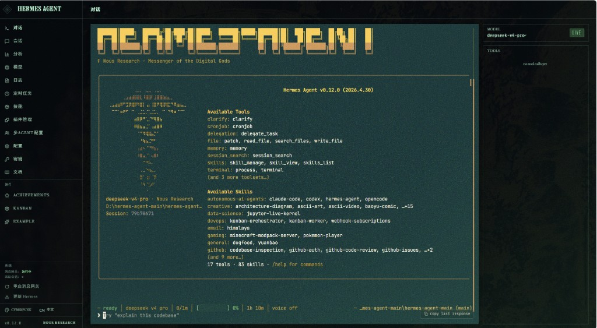

# hermes-agent-win-gui

在 [Hermes Agent](https://github.com/NousResearch/hermes-agent) 上游基础上的自用维护分支：**可在纯 Windows 环境下本地运行**，带 **浏览器中的 Web 仪表盘（Dashboard）**，并包含对 **飞书（Lark）交互卡片审批** 等场景的适配与修复说明。

---

## 界面预览（Web Dashboard）

以下为 **Windows 本机** 运行仪表盘后的示意（侧边栏、终端区、模型与工具状态等）。若你不希望截图里出现本机路径或会话信息，可自行打码后再替换 `assets/readme-dashboard-windows.png`。



---

## 本仓库在做什么

| 方向 | 说明 |
|------|------|
| **纯 Windows** | 使用 **PowerShell + Python 虚拟环境** 安装与运行，无需 WSL 即可使用 CLI、Dashboard、网关等能力（具体能力取决于你安装的 pip extra）。 |
| **可视化** | 通过下方 **`dashboard`** 命令在浏览器中打开管理界面（配置、会话、内嵌 Chat 等）。 |
| **消息网关** | 通过 **`gateway run`** 前台运行网关，连接飞书 / Telegram 等平台时需安装 **`[messaging]`** 或 **`[feishu]`** 等依赖，并完成开放平台机器人配置。 |

更细的排障与发布清单见：**[docs/zh/安装与启动指南.md](docs/zh/安装与启动指南.md)**。  
目录与开发约定见：**[AGENTS.md](AGENTS.md)**。

---

## 环境要求（Windows）

- **Windows 10 / 11**（64 位）
- **Python** ≥ 3.11（安装时勾选 *Add python.exe to PATH* 更方便）
- **Git**（克隆本仓库）
- **Node.js** ≥ 20：仅当你需要 **单独开发 / 构建 `web/` 前端** 或 **`ui-tui/`** 时再装

---

## 安装环境

在 **仓库根目录**（含有 `pyproject.toml`）打开 **PowerShell**。

### 1. 创建并激活虚拟环境

下面示例使用目录名 **`venv`**。若你习惯用 **`.venv`**，请把路径里的 `venv` 改成 `.venv`。

```powershell
cd D:\path\to\hermes-agent-win-gui
py -3.11 -m venv venv
.\venv\Scripts\Activate.ps1
python -m pip install -U pip setuptools wheel
```

若提示无法执行脚本，可先执行：`Set-ExecutionPolicy -Scope CurrentUser RemoteSigned`。

### 2. 安装 Hermes（可编辑安装）

**推荐**（Web 仪表盘 + 内嵌终端所需依赖，含 Windows **pywinpty**）：

```powershell
pip install -e ".[web]"
```

若还要跑 **飞书 / Telegram 等消息网关**，建议一并安装（体积更大）：

```powershell
pip install -e ".[web,messaging,feishu]"
```

仅核心 CLI（无 Dashboard）：

```powershell
pip install -e "."
```

安装完成后检查：

```powershell
.\venv\Scripts\hermes.exe --help
```

### 3. 首次配置

```powershell
.\venv\Scripts\hermes.exe setup
```

- 配置与 **`%USERPROFILE%\.hermes`**（或环境变量 **`HERMES_HOME`**）下的 `config.yaml`、`.env` 相关。  
- **API Key、Token 只写入 `HERMES_HOME\.env`**，不要提交到 Git（仓库已用 `.gitignore` 忽略 `.env`）。

```powershell
.\venv\Scripts\hermes.exe doctor
```

---

## 启动（两条常用命令）

以下均假设当前目录为项目根，且虚拟环境在 **`venv`**（否则请改路径）。

### ① Web 仪表盘（指定端口 9120）

```powershell
.\venv\Scripts\hermes.exe dashboard --no-open --port 9120
```

在浏览器打开：**http://127.0.0.1:9120**（若改了 `--host` 则以实际为准）。

### ② 消息网关（前台 + 详细日志）

```powershell
.\venv\Scripts\hermes.exe gateway run -v
```

**说明（当前环境经验）：** 在 **纯 Windows** 下，网关进程 **目前需要以「管理员身份」运行 PowerShell / 终端**，再执行上述 `gateway run` 命令，否则可能因权限或端口策略无法正常监听。**Dashboard 一般无需管理员**。

---

## 其它常用命令

```powershell
.\venv\Scripts\hermes.exe                    # 经典交互 CLI
.\venv\Scripts\hermes.exe model              # 选择模型与供应商
.\venv\Scripts\hermes.exe tools              # 工具开关
.\venv\Scripts\hermes.exe --tui            # 终端 TUI（需按文档构建 ui-tui）
```

---

## 隐私与仓库内容说明（已帮你做过静态检查）

已对仓库内 **会被 Git 跟踪** 的配置类模板做了静态检查，结论如下：

| 检查项 | 结论 |
|--------|------|
| **`.env.example`** | 仅为注释与占位说明，无真实密钥赋值。 |
| **`cli-config.yaml.example`** | 使用占位说明（如 `your-key-here`），无有效密钥。 |
| **根目录 `.env`** | 若你本机存在该文件，**属于个人密钥**，且应在 **`.gitignore`** 中；**切勿** `git add` 后推送。 |
| **测试代码中的 `sk-xxx`** | 多为单元测试用假字符串，非真实 API Key。 |

**截图注意：** 你提供的 Dashboard 截图里可能含有 **本机路径**（如 `D:\...`）、**会话 id**、**模型名称** 等；若介意公开，发布前可换一张打码图覆盖 **`assets/readme-dashboard-windows.png`**。

---

## 上游与许可证

- 上游：**[NousResearch/hermes-agent](https://github.com/NousResearch/hermes-agent)**  
- 许可证：**MIT**，见 **[LICENSE](LICENSE)**。
