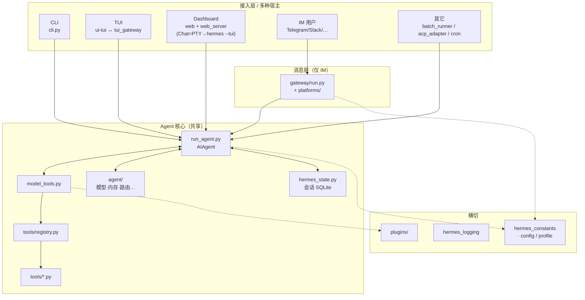

# Hermes Agent — 系统架构说明

本文基于仓库顶层目录与官方入口约定（`AGENTS.md`、`hermes_cli/main.py` 等）整理，描述整体设计思路与模块边界，**不涉及函数级实现**。文末包含与 **OpenClaw 式「客户端 → 统一接口 → 网关 → Agent」** 模式的对比、**本仓库完整顶层架构**与**典型执行流程**梳理。

**交叉引用**：在 Cursor 中与本仓库对话时，**常驻精简规则**见 **`.cursor/rules/hermes-architecture-and-local-dev.mdc`**（`alwaysApply`，侧重本地启动命令与架构表）；**本文档**为架构与设计的长说明，二者互补。

---

## 一、设计思路与架构模式

| 维度 | 说明 |
|------|------|
| **核心范式** | **同步 Agent 循环**：`AIAgent`（`run_agent.py`）驱动「LLM ↔ 工具调用」直至产出最终回复；网关、TUI、Dashboard 等仅为不同宿主进程调用同一套 Agent 与工具。 |
| **工具系统** | **注册表模式**：`tools/registry.py` 保持轻依赖；各 `tools/*.py` 在导入时 `registry.register()`；`model_tools.py` 负责发现与 `handle_function_call()` 分发。 |
| **配置与数据面** | **Profile 化 Home**：`hermes_constants.get_hermes_home()` 锚定 `config.yaml`、`.env`、SQLite 会话与日志；网关与 TUI 可通过环境变量桥接 `terminal.cwd` 等。 |
| **消息与 UI 分离** | **通道适配**：即时消息（Telegram 等）走 `gateway/`；本地交互走 **CLI / `--tui`（Ink + `tui_gateway`）/ Dashboard（FastAPI + 前端 SPA）**；共享 Agent 核心，而非三套独立业务内核。 |

---

## 二、顶层功能模块与代码映射

| 功能模块 | 主要职责 | 主要由哪些目录 / 核心文件承载 |
|----------|----------|--------------------------------|
| **Agent 引擎** | 对话循环、预算、中断、工具编排、模型路由 | `run_agent.py`、`model_tools.py`、`toolsets.py`、`agent/` |
| **CLI 外壳** | 子命令、交互会话、仪表盘入口、皮肤与展示 | `hermes_cli/main.py`（入口）、`cli.py`、`hermes_cli/commands.py`、`hermes_cli/config.py`、`agent/display.py`、`hermes_cli/skin_engine.py` |
| **工具运行时** | 各类 Tool、终端多后端、文件操作等 | `tools/`（含 `tools/registry.py`、`tools/environments/`） |
| **会话与状态** | SQLite 会话、FTS | `hermes_state.py` |
| **常量与日志** | `HERMES_HOME`、日志初始化 | `hermes_constants.py`、`hermes_logging.py` |
| **消息网关（IM）** | 连接外部 IM，将会话路由到 Agent | `gateway/run.py`、`gateway/session.py`、`gateway/platforms/`、`gateway/config.py`、`gateway/status.py`、`gateway/restart.py` |
| **Gateway 命令与进程编排** | `gateway run/start/stop/restart`、PID 文件、`--replace`、与 Dashboard 重启联动 | `hermes_cli/gateway.py`（CLI 面）、协同 `gateway/status.py`、`gateway/restart.py` |
| **Web 管理面板（后端）** | REST/WebSocket、仪表盘 API、内嵌 Chat 相关进程编排 | `hermes_cli/web_server.py`、`hermes_cli/pty_bridge.py`；静态资源 `hermes_cli/web_dist/` |
| **Web 前端** | Dashboard SPA（Vite + React） | `web/`（源码） |
| **终端 TUI** | Ink/React 终端界面 | `ui-tui/` |
| **TUI 对话后端** | 与 Ink 之间的 JSON-RPC、会话与 slash 命令 | `tui_gateway/` |
| **插件扩展** | 内存、上下文引擎、Dashboard、图像等 | `plugins/` |
| **技能包** | 内置技能与可选技能源 | `skills/`、`optional-skills/` |
| **定时任务** | Cron 调度与任务定义 | `cron/` |
| **编辑器集成（ACP）** | VS Code / JetBrains 等协议侧 | `acp_adapter/` |
| **文档站点** | 对外文档 | `website/` |
| **测试与脚本** | 回归测试、发布脚本 | `tests/`、`scripts/` |
| **其它** | 并行批处理、RL 环境等 | `batch_runner.py`、`environments/` |

---

## 三、入口文件与前后端边界

### 1. 进程级入口

| 入口 | 典型用法 | 角色 |
|------|-----------|------|
| **`hermes_cli/main.py`** | `python -m hermes_cli.main`、`hermes …` | **统一 CLI 入口**：聚合 `chat`、`dashboard`、`gateway`、`setup`、`cron`、`acp` 等子命令。 |
| **`gateway/run.py`**（经 CLI） | `hermes gateway run` / `gateway start` | **消息网关进程**：加载平台适配器，将 IM 消息交给 Agent。 |
| **`hermes_cli/web_server.py`**（经 CLI） | `hermes dashboard` | **Web 后端**：FastAPI 等；托管 API 与静态 SPA；内嵌 Chat 通过 PTY 与子进程衔接（见 `hermes_cli/pty_bridge.py`）。 |
| **`tui_gateway`**（经 `--tui`） | `hermes --tui` | **TUI 的 Python 侧**：stdio JSON-RPC，与 `ui-tui/` Node 进程配对。 |

### 2. 「前端」形态（多套 UI，共用后端能力）

| 形态 | 代码位置 | 对接方式 |
|------|-----------|----------|
| **Dashboard 浏览器 UI** | `web/` → 构建产物进入 `hermes_cli/web_dist/` | HTTP → `hermes_cli/web_server.py` |
| **终端 TUI** | `ui-tui/` | stdio JSON-RPC ↔ `tui_gateway/` |
| **经典 CLI** | `cli.py` 等 | 进程内直接驱动 `AIAgent`，无独立 HTTP 层 |

### 3. 外部服务依赖（集成位置概览）

| 类型 | 顶层集成位置 | 说明 |
|------|----------------|------|
| **LLM / API** | `agent/`、`run_agent.py` | 按配置路由；密钥多在 `~/.hermes/.env`。 |
| **IM 平台** | `gateway/platforms/`、`plugins/platforms/` | 每平台适配层；配置来自 `gateway/config.py` 与用户 `config.yaml` / `.env`。 |
| **终端执行环境** | `tools/environments/`、`tools/terminal_tool.py` | local/docker/ssh/modal 等；与 `terminal.*`、`TERMINAL_*` 协同。 |
| **可选云端沙箱** | 各 backend 模块 | Docker、Modal、Daytona、Vercel Sandbox 等按需启用。 |
| **插件类扩展** | `plugins/memory/`、`plugins/context_engine/` 等 | 通过插件框架与 `model_tools` 生命周期衔接。 |

### 4. Dashboard 后端对外接口入口（与网关运维相关）

| 接口 / 能力 | 顶层文件 | 说明 |
|-------------|-----------|------|
| **REST + 静态 SPA** | `hermes_cli/web_server.py` | FastAPI `app`：托管 `web_dist`、会话与配置类 API 等。 |
| **内嵌 Chat（PTY）** | `hermes_cli/web_server.py`（WebSocket）、`hermes_cli/pty_bridge.py` | 浏览器 **不做第二套对话内核**：通过 PTY 拉起 **`hermes --tui`**，与 `ui-tui/` + `tui_gateway/` 共用同一交互栈。 |
| **重启消息网关** | `POST /api/gateway/restart` → `_spawn_hermes_action` | 子进程执行 `hermes gateway restart`，可对同完整性级别的网关发 **SIGTERM**；日志见 `%HERMES_HOME%/logs/gateway-restart.log`。可通过环境变量 **`HERMES_DASHBOARD_DISABLE_GATEWAY_RESTART`** 关闭（见 `hermes_cli/config.py`）。 |

---

## 四、模块依赖与调用关系（逻辑视图）

```
                    ┌─────────────────────────────────────────┐
                    │  宿主入口（选一）                        │
                    │  main.py → chat / dashboard / gateway    │
                    └─────────────────┬───────────────────────┘
                                      │
          ┌───────────────────────────┼───────────────────────────┐
          ▼                           ▼                           ▼
   ┌─────────────┐           ┌───────────────┐           ┌─────────────────┐
   │ cli.py      │           │ web_server.py │           │ gateway/run.py   │
   │（交互 CLI） │           │（Dashboard）   │           │（消息网关）      │
   └──────┬──────┘           └───────┬───────┘           └────────┬─────────┘
          │                         │                             │
          └─────────────────────────┼─────────────────────────────┘
                                      ▼
                            ┌─────────────────┐
                            │  run_agent.py    │
                            │  AIAgent 循环    │
                            └────────┬─────────┘
                                     │
              ┌──────────────────────┼──────────────────────┐
              ▼                      ▼                      ▼
       ┌─────────────┐       ┌─────────────┐       ┌──────────────┐
       │model_tools   │       │ agent/      │       │hermes_state   │
       │工具编排       │       │模型/内存等   │       │会话持久化     │
       └──────┬──────┘       └─────────────┘       └──────────────┘
              │
              ▼
       ┌─────────────┐
       │ tools/*.py   │
       │ + registry   │
       └──────┬──────┘
              │
              ▼
       ┌─────────────────────┐
       │ tools/environments/   │（terminal 多后端）
       └─────────────────────┘

  TUI：ui-tui/ ←stdio→ tui_gateway/ → 同样收敛到 AIAgent + model_tools
```

**依赖方向**：入口 → **`run_agent.py` / `AIAgent`** → **`model_tools.py`** → **`tools/`**；会话读写 **`hermes_state.py`**；路径与 profile **`hermes_constants.py`**。

**工具链**：`tools/registry.py` ← 各 tool 模块 import 副作用 ← **`model_tools` 导入触发发现**（参见 `AGENTS.md` 中的依赖链说明）。

---

## 五、依赖链（官方摘要）

```
tools/registry.py  （无上游业务依赖）
       ↑
tools/*.py  （各模块 register()）
       ↑
model_tools.py  （导入 registry 并触发工具发现）
       ↑
run_agent.py、cli.py、batch_runner.py、environments/
```

---

## 六、小结（模块级）

1. **模块划分**：核心是 **Agent 引擎（`run_agent.py` + `agent/`）** 与 **工具层（`tools/` + `model_tools.py`）**；外围为多种 **入口壳**（CLI、Web、网关、TUI）及 **插件（`plugins/`）**。  
2. **集成方式**：各入口装配配置与会话后调用 **`AIAgent.run_conversation`**（或等价路径）；工具经 **统一注册表** 暴露给模型；IM 经 **`gateway/platforms/`** 接入外部网络。  
3. **顶层目录即边界**：一级文件夹与上文「功能模块」表对应；子目录细节以仓库与 `AGENTS.md` 为准。

---

## 七、与 OpenClaw 式架构的对比（参考示意图）

以下对照基于常见「OpenClaw」类示意图：**客户端（Web / macOS / iOS / 自定义）→ 统一接口 → Gateway（常强调鉴权/路由）→ Agent**，且 Agent 输出经**反馈回路**回到统一接口（流式、多轮或异步推送）。

| 维度 | OpenClaw 式（示意图抽象） | Hermes Agent（本仓库） |
|------|---------------------------|------------------------|
| **客户端形态** | 强调 **多终端产品壳**（Web、桌面、移动）+ **自定义客户端** 接同一套后端 | **无单一「官方移动/Web 壳」边界**：本地 **CLI**、**终端 TUI**（`ui-tui`）、**浏览器 Dashboard**（`web` + `web_server`）、**IM 端用户**（Telegram 等）并行存在；**ACP** 对接编辑器 |
| **「统一接口」层** | 显式 **一层 API / BFF**，所有客户端先汇聚到此 | **没有与示意图等价的、独占的「统一 HTTP API」**：多种入口各自装配会话与配置，最终 **语义上** 都落到 **`AIAgent` + `model_tools` + `tools`**；**Dashboard** 的 REST/WebSocket 主要服务管理面板，聊天主体仍是 **内嵌 `hermes --tui`（PTY）** |
| **Gateway 含义** | 常为 **对外流量网关**（安全、限流、路由） | **`gateway/` 主要指「即时消息网关」**：连接 Telegram/Slack/Discord 等 **`gateway/platforms/`**，把频道消息转成 Agent 对话；**不是**所有客户端必经的同一网络网关 |
| **与 Agent 的关系** | 线性：客户端 → 统一接口 → 网关 → Agent | **多分支汇入**：CLI / TUI 后端 / IM 网关 / `batch_runner` 等均可直接驱动 **同一 Agent 核心**，路径不同、代码入口不同 |
| **反馈 / 回流** | 图中 **Agent → 回到统一接口** 强调闭环（流式、推送） | **各宿主自带闭环**：CLI 用终端回调；TUI 用 **stdio JSON-RPC 事件**（`message.delta` 等）；网关用 **平台发送 API** 回写消息；Dashboard 的 Chat 经 **PTY 字节流** 回显 — **没有单独命名的「统一回流层」** |
| **安全边界** | 常集中在 **网关 + 统一接口** | **分散配置**：`gateway` 侧配对/令牌、`config.yaml`、凭证池、工具审批等；无与 OpenClaw 图一一对应的「单层盾牌」抽象 |

**概括**：OpenClaw 图突出 **产品化多客户端 + 单一接入面 + 网络型网关**；Hermes 突出 **同一 Agent/工具内核 + 多宿主进程与多传输形态**，**IM 网关**与 **本地/终端/Web 编排** 分担不同职责，**不强行收敛成一条「统一接口 → 唯一 Gateway」链**。

---

## 八、完整顶层架构（单页总览）

逻辑分层如下（与目录对应，非部署拓扑）。



**读图要点**：

1. **「客户端」在 Hermes 里是多种运行时**：不是只有浏览器或 App，而是 **终端进程、Node+Python TUI 对、浏览器里的 xterm+子进程、IM 机器人** 等。  
2. **只有 IM 场景** 必经 **`gateway/`**；本地 CLI/TUI 通常 **直连 Agent**，不经过 `gateway/run.py`。  
3. **核心始终是同步 Agent 循环**：`AIAgent` ↔ LLM ↔ **`model_tools.handle_function_call`** ↔ **`tools/`**；会话落 **`hermes_state`**。  
4. **插件、配置、日志** 横切各入口，不改变「单核 Agent」抽象。

---

## 九、典型执行流程（按场景）

### 1. 交互式 CLI（默认 `hermes` / `hermes chat`）

1. `hermes_cli/main.py` 解析参数，进入 **`HermesCLI`**（`cli.py`）。  
2. 加载 **`load_cli_config()`**，应用 **`HERMES_HOME` / profile**，初始化皮肤与日志。  
3. 用户输入经 **`process_command()`**（slash 命令等）或作为用户消息进入会话。  
4. 构造 **`AIAgent`**，调用 **`run_conversation()`**：循环 **`chat.completions` + tool_calls** → **`handle_function_call`** → 工具结果写回消息列表，直至无工具调用或预算耗尽。  
5. 结果经 **`display`/Rich** 输出；会话写入 **`SessionDB`（`hermes_state`）**。

### 2. 终端 TUI（`hermes --tui`）

1. 启动 **Node/Ink**（`ui-tui`）子进程与 **`tui_gateway`** Python 侧 **stdio JSON-RPC**。  
2. 用户在 Ink 中提交 prompt → **`prompt.submit`** → 网关内 **`AIAgent`** 跑一轮 **`run_conversation`**（与 CLI 同核）。  
3. 流式回复通过 **`message.delta` / `message.complete`** 等 **事件** 推回 Ink；工具进度走 **`tool.*`** 事件。  
4. Slash 命令部分在客户端短路，其余走 **`slash.exec` / `command.dispatch`** 与 CLI 注册表对齐。

### 3. Dashboard Web（`hermes dashboard`）

1. **`hermes_cli/web_server.py`** 启动 FastAPI，托管 **`web_dist` SPA** 与 REST/WebSocket API（默认端口等在 `hermes_cli/main.py` 的 `dashboard` 子命令中配置，如 `--port`）。  
2. **对话页**：前端源码 **`web/src/pages/ChatPage.tsx`**（及侧边栏等）通过 **xterm.js + WebSocket** 对接 **`/api/pty`**；服务端 **`pty_bridge`** 创建伪终端子进程并运行 **`hermes --tui`** —— **字节级终端协议**，不是「浏览器直连 REST 对话 API」。  
3. **系统侧栏**：如「重启消息网关」走 **`POST /api/gateway/restart`**（见上文 §三.4），与独立终端中的 **`hermes gateway run`** 属于**不同进程**；开发时常需二者 **权限一致** 或使用 **`HERMES_DASHBOARD_DISABLE_GATEWAY_RESTART`** 避免误杀前台网关。  
4. 其它仪表盘功能（会话列表、配置入口等）走 **独立 HTTP API**，与 Agent 循环解耦。

### 4. 消息网关（`hermes gateway run` / `gateway start`）

1. 读取 **网关配置**（`gateway/config.py` + 用户 `config.yaml`），启动 **`gateway/run.py`** 主循环（CLI 入口经 **`hermes_cli/gateway.py`** → `asyncio.run(start_gateway)`）。  
2. 按配置加载 **`gateway/platforms/<telegram|slack|feishu|…>`** 适配器，连接各 IM API/Webhook/WebSocket。  
3. 用户消息进入会话路由 → 构造 **`AIAgent`**（含 `platform=` 等上下文）→ **`run_conversation`**。  
4. 回复通过适配器 **发回频道/私聊**；后台终端任务等由网关策略与配置（如 `terminal.cwd`、`display.background_process_notifications`）协同。  
5. **Windows** 上另有事件循环策略、faulthandler、嵌入 Kanban 开关等横切约定（见 **§十二**），不改变「IM → `gateway/run.py` → `AIAgent`」这条主线。

### 5. 其它入口（简叙）

| 入口 | 流向 |
|------|------|
| **`batch_runner.py`** | 批量任务并行调用 Agent API，仍依赖 **`run_agent` / `model_tools`** 链。 |
| **`acp_adapter/`** | 编辑器协议服务进程，将编辑会话映射到 Agent 对话。 |
| **`cron/`** | 定时触发任务，可间接拉起 Agent 或网关侧逻辑（以具体任务为准）。 |

### 6. 端到端数据路径（共性）

**用户可见输入** → **宿主解析（CLI / JSON-RPC / IM / PTY）** → **`AIAgent.run_conversation`** → **LLM** → **（可选）工具调用链** → **持久化会话** → **宿主输出（终端 / 事件 / IM / PTY）**。

---

## 十、信息流向：功能载体与交互逻辑

以下从 **客户端交互**、**系统层**、**Gateway**、**Agent** 四层说明「谁搬运信息」以及 **彼此之间如何衔接**。功能载体 = 在该层实际承担传输、解析、编排或执行的模块/协议/存储。

### 1. 各层主要功能载体（汇总）

| 层级 | 角色 | 典型功能载体（代码 / 协议 / 介质） |
|------|------|-------------------------------------|
| **客户端交互** | 人机界面与传输 | **CLI**：终端标准输入输出、`prompt_toolkit`、`Rich`/`display.py`。**TUI**：Ink/`ui-tui` ↔ **`stdio` 上的 JSON-RPC** ↔ `tui_gateway/`。**Dashboard 聊天**：`web/src/pages/ChatPage.tsx` 等 + **`xterm.js`** ↔ **WebSocket `/api/pty`** ↔ **`hermes_cli/pty_bridge.py`** ↔ 子进程 **`hermes --tui`**（终端字节流，**非** REST 对话 API）。**IM**：各平台 **Bot API / Webhook / WebSocket**（`gateway/platforms/`）。**ACP**：编辑器协议通道。 |
| **系统层** | 配置、进程入口、会话与横切 | **`hermes_cli/main.py`**：子命令与参数，决定启动哪条链。**`hermes_cli/config.py` + `load_cli_config` / `load_config`**：合并默认与用户 **`config.yaml`**；**`.env`** 管密钥。**`hermes_constants` / `HERMES_HOME`**：配置与数据根路径、多 profile。**`hermes_state.py`（`SessionDB`）**：会话与消息的 **SQLite 持久化**（及 FTS 等）。**`hermes_logging.py`**：落盘日志。 |
| **Gateway** | 仅 **即时消息** 场景：外网/平台 ↔ 本进程内 Agent 的桥梁 | **`gateway/run.py`**：网关主循环、与 Agent 生命周期的衔接。**`gateway/session.py` 等**：会话键、排队、与平台消息的对齐。**`gateway/platforms/<平台>.py`**：把 **平台 JSON/事件** 变成「用户消息」，把 **Agent 最终回复** 变成 **平台发消息 API** 调用。**`gateway/config.py` + 状态 `gateway/status.py`**：网关配置与进程/健康状态。 |
| **Agent** | 对话推理与工具执行 | **`run_agent.py` / `AIAgent`**：主循环、消息列表、工具调用轮次。**`model_tools.py`**：工具模式收集、**`handle_function_call`** 分发、插件前后钩。**`tools/registry.py` + `tools/*.py`**：具体工具实现。**`agent/`**：提供方适配、内存、路由、压缩等。**对外 LLM 调用**：HTTP 客户端 → 各云厂商 **Chat Completions / 等价 API**。 |

### 2. 交互逻辑：谁先连谁、是否经过 Gateway

用「信息从哪进、从哪出」看逻辑关系（**不是**所有客户端都进 Gateway）。

```
                    ┌─────────────────────────────────────────┐
                    │ 系统层：入口路由 + 配置 + SessionDB       │
                    └───────────────────┬─────────────────────┘
                                        │
     ┌──────────────────────────────────┼──────────────────────────────────┐
     │ 不经 Gateway                      │ 经 Gateway（仅 IM）               │
     ▼                                   ▼                                   │
┌────────────┐                    ┌─────────────────┐                         │
│ CLI        │                    │ IM 平台 API      │                         │
│ TUI JSON-RPC                   │ → platforms/    │                         │
│ Dashboard PTY（=TUI 字节流）    │ → gateway/run   │                         │
└─────┬──────┘                    └────────┬────────┘                         │
      │                                   │                                  │
      └───────────────┬───────────────────┘                                  │
                      ▼                                                     │
              ┌───────────────┐                                             │
              │ AIAgent       │  ← model_tools → tools / agent / LLM HTTP     │
              └───────┬───────┘                                             │
                      │                                                     │
        ┌─────────────┼─────────────┐                                       │
        ▼             ▼             ▼                                       │
   SessionDB      日志          同路径回流                                   │
        │             │             │                                       │
        └─────────────┴─────────────┘                                       │
                      │                                                     │
        输出：终端 / JSON-RPC 事件 / PTY 字节 / 平台 sendMessage               │
```

- **本地交互（CLI / TUI / Dashboard 里的 Chat）**：客户端载体直接把「用户文本或终端事件」交给 **同一 Python 进程内的 `AIAgent`**（TUI 经 `tui_gateway` 转发；Dashboard 经 PTY 等价于驱动 TUI）。**不经过 `gateway/run.py`**。  
- **即时消息（Telegram、Slack 等）**：客户端载体是 **IM 网络 ↔ 平台适配器**；必须先进入 **`gateway/run.py`  orchestration**，再由适配器把标准化后的用户消息交给 **`AIAgent`**；回复沿 **适配器 → 平台 API** 回去。  
- **系统层**在所有路径中参与：**启动入口**、**读配置**、**读写会话**；Gateway 路径下还会叠加 **网关专用配置与平台连接状态**。

### 3. 一条逻辑链（对照记忆）

| 阶段 | 做什么 |
|------|--------|
| **进** | 用户或 IM 产生文本/命令 → 由 **终端、JSON-RPC、PTY 字节流或平台 Webhook** 送入对应宿主或 Gateway。 |
| **编** | **系统层** 解析配置、绑定会话（`SessionDB`）、必要时 **Gateway** 做平台路由与排队。 |
| **核** | **`AIAgent.run_conversation`**：与 **LLM** 往返；若有 **tool_calls**，经 **`model_tools`** 执行 **`tools/`**，结果写回消息列表。 |
| **存** | 会话与工具副作用落在 **`hermes_state`**、日志与可选插件存储。 |
| **出** | 同一宿主路径原路返回（终端画屏、TUI 事件、PTY、或 **Gateway → 平台发消息**）。 |

---

## 十一、对话交互界面：三种宿主与代码归属

以下为「用户在哪里打字」与「哪段代码负责渲染与传输」的**顶层对应**，便于与 OpenClaw 式「单一 Web App」区分。

| 交互界面 | 用户感知 | 顶层代码 / 进程 | 与 Agent 核心的衔接 |
|----------|----------|-------------------|---------------------|
| **经典 CLI** | 终端里的 `hermes` / `hermes chat` | `cli.py`、`hermes_cli/main.py` | **进程内** `AIAgent`，不经 `gateway/run.py`。 |
| **终端 TUI** | `hermes --tui`，全屏 Ink UI | **`ui-tui/`**（Node/Ink）↔ **`tui_gateway/`**（Python，stdio **JSON-RPC**） | `tui_gateway` 内构造 `AIAgent` / 等同路径；与 CLI **同源循环**。 |
| **Dashboard 浏览器** | 网页侧栏、配置、**Chat 标签** | **`web/`**（构建 → **`hermes_cli/web_dist/`**）+ **`hermes_cli/web_server.py`** | **管理类页面**：REST/API。**Chat 页**：仅 **PTY + 子进程 `hermes --tui`**（`pty_bridge`），对话语义仍落在 **TUI 栈**，不在 React 内重写一套 Agent UI（见 `AGENTS.md`「不要在 Dashboard 重做主聊天」）。 |
| **即时消息（IM）** | Telegram / 飞书等客户端 | **`gateway/platforms/*`**，主编排 **`gateway/run.py`** | 消息进入网关后再驱动 **`AIAgent`**；回复走平台 SDK/API。 |

**设计要点**：对话「业务内核」集中在 **`run_agent.py` + `model_tools.py` + `tools/`**；**CLI / TUI / Dashboard Chat** 是三种 **宿主与 IO 形态**，其中 Dashboard Chat **刻意复用 TUI**，以降低分叉和维护成本。

---

## 十二、Windows 兼容与设计要点（模块级，非函数级）

本节汇总与本仓库相关的 **Windows 特化**，便于架构阅读时与 Linux/macOS 对比；细节与 env 键名以 **`AGENTS.md`**、`hermes_cli/config.py` 的 `OPTIONAL_ENV_VARS` 为准。

### 1. 进程与权限

| 主题 | 涉及顶层模块 | 说明 |
|------|----------------|------|
| **Dashboard vs Gateway** | `hermes_cli/web_server.py`、`hermes_cli/gateway.py` | 二者常为**两个独立进程**；Dashboard 触发的 **`gateway restart`** 子进程与前台 **`gateway run`** 的 **完整性级别（是否管理员）** 不一致时，可能出现「无法终止 / 或反而误杀」等行为差异，需统一运维方式或使用 **`HERMES_DASHBOARD_DISABLE_GATEWAY_RESTART`**。 |
| **可选 UAC 提权** | `hermes_cli/gateway.py`、`hermes_cli/main.py` | **`hermes gateway run --elevate`**（仅 Windows）：通过 ShellExecute `runas` 再起一行命令；**非默认**，避免全局管理员依赖。 |

### 2. 消息网关（`gateway/run.py`）在 Windows 上的横切约定

| 主题 | 涉及位置 | 说明 |
|------|-----------|------|
| **asyncio 事件循环策略** | `hermes_cli/gateway.py`（`configure_windows_gateway_event_loop_policy`）、`gateway/run.py` | 默认选用更稳妥的 **Selector** 策略；**Proactor** 可通过 **`HERMES_GATEWAY_WIN_USE_PROACTOR`** 显式开启（ Feishu/Lark WebSocket + 线程场景下的历史兼容项）。 |
| **信号** | `gateway/run.py` | 无 `add_signal_handler` 时使用 **stdlib `signal.signal`** 回退，保证 **`SIGTERM`/`gateway --replace`** 仍可走优雅退出路径。 |
| **诊断** | `hermes_cli/gateway.py`、`gateway/run.py` | **faulthandler** 等在 Windows 上默认可写入 **`HERMES_HOME/logs/gateway_faulthandler.log`**（可用 **`HERMES_GATEWAY_FAULTHANDLER`** 关闭）。 |
| **Stale-code 自检** | `gateway/run.py` | **Windows 默认关闭**「源码 mtime 触发自重启」；需时用 **`HERMES_GATEWAY_ENABLE_STALE_CODE_CHECK`** 显式开启（避免 IDE/杀毒触碰 sentinel 文件导致误判）。 |
| **嵌入 Kanban** | `gateway/run.py`、`hermes_cli/kanban_db.py` | Windows **默认不嵌入** Kanban 于网关进程；若启用（如 **`HERMES_KANBAN_EMBED_IN_GATEWAY_WINDOWS`**），通过延迟与专用线程池降低与 IM WebSocket 握手窗口冲突（设计上仍推荐独立 **`hermes kanban daemon`**）。 |
| **Feishu/Lark** | `gateway/platforms/feishu.py` | 官方 SDK **WebSocket 客户端跑在独立线程 + 线程私有 asyncio loop**，与网关主循环隔离；避免与线程池/错误 loop 混用导致进程异常退出（顶层约束）。 |

### 3. 控制台与 Dashboard 子进程

| 主题 | 涉及位置 | 说明 |
|------|-----------|------|
| **stdio 编码** | `hermes_constants.configure_stdio_utf8_windows`（由 CLI/Web 入口调用） | 减轻 **GBK 控制台**下图形字符与 JSON-RPC 乱码问题。 |
| **PTY / 内嵌 Chat** | `hermes_cli/pty_bridge.py`、`hermes_cli/web_server.py` | 原生 Windows 上 PTY 依赖 **`pywinpty`**（Web extra）；与 WSL/Linux 路径不同，属于 **部署能力** 而非第二套 Agent。 |
| **环境变量（PowerShell）** | 运维约定 | 会话级变量应使用 **`$env:NAME = "value"`**，勿混用 CMD 的 `set`，否则子进程（如 `hermes.exe`）读不到预期 env。 |

### 4. 依赖关系（Windows 补充视角）

在 **§四** 逻辑图基础上，Windows 仅增加 **「宿主 OS 策略层」**对以下模块的约束，不改变箭头方向：

- **`gateway/run.py`** ↔ **事件循环 / 信号 / 可选嵌入任务 / 平台适配器线程**
- **`hermes_cli/web_server.py`** ↔ **PTY 能力、子进程 `hermes --tui` 的编码与环境**
- **`hermes_cli/gateway.py`** ↔ **入口层策略（faulthandler、asyncio policy、`--elevate`）**

---

*文档版本：与仓库顶层结构及当前 Windows/对话界面约定对齐；目录或 env 变更请以 `AGENTS.md` 与源码为准。*
